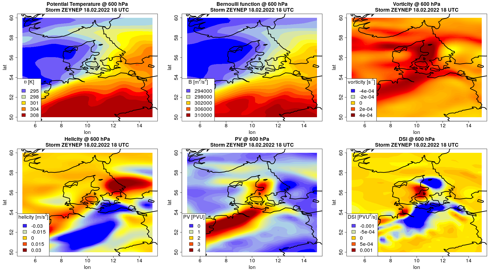

# meteoEVT: Computation and Visualization of Energetic and Vortical Atmospheric Quantities

<!-- badges: start --> 
[](https://cran.r-project.org/package=meteoEVT)
[](https://cran.r-project.org/package=meteoEVT)
[](https://github.com/noctiluc3nt/meteoEVT)
[](https://www.gnu.org/licenses/gpl-2.0.html)
<!-- badges: end -->

Energy-Vorticity theory (EVT) is the fundamental theory to describe processes in the atmosphere by combining conserved quantities from hydrodynamics and thermodynamics. The package 'meteoEVT' provides functions to calculate many energetic and vortical quantities, e.g., potential vorticity, Bernoulli function and dynamic state index (DSI) [e.g. Weber and Nevir, 2008, <doi:10.1111/j.1600-0870.2007.00272.x>], for given gridded data, e.g., ERA5 reanalyses. These quantities can be studied directly or can be used for many applications in meteorology, e.g., the objective identification of atmospheric fronts. For this purpose, several functions are provided which allow the detection of fronts based on the thermic front parameter [Hewson, 1998, <doi:10.1017/S1350482798000553>], the F diagnostic [Parfitt et al., 2017, <doi:10.1002/2017GL073662>] and the DSI [Mack et al., 2022, <arXiv:2208.11438>]

## Installation
Installing the current version of meteoEVT from CRAN:
```r
install.packages("meteoEVT")
```

Installing the current (development) version of meteoEVT from github:
```r
devtools::install_git("https://github.com/noctiluc3nt/meteoEVT")
```


## Examples
Here is an example showing the analysis of winter storm ZEYNEP/EUNICE over Germany on 18.02.2022:

``` r
### step 1: read in the data
data = readin_era5('meteoEVT/inst/extdata/era5_storm-zeynep.nc')

### step 2: custom plot layout (optional)
par(mfrow=c(2,3))
par(cex.main=1.8,cex.lab=1.8,cex.axis=1.8)
par(mar=c(4, 5, 4, 2) + 0.1)
nl=length(data$lat)
library('latex2exp')

### step 3: calculation and visualization 
#calculate potential temperature
theta=calc_theta(data$temp,data$lev)
fill_horiz(data$lon,rev(data$lat),theta[,nl:1,3],
	main='Potential Temperature @ 600 hPa\nStorm ZEYNEP 18.02.2022 18 UTC',
	levels=c(29,seq(29.5,30.8,0.1),32)*10^1, legend_loc='bottomleft',
	legend_title=TeX('$\\theta$ \\[K\\]'),xlab='lon',ylab='lat')

#calculate Bernoulli function
bernoulli=calc_bernoulli(data$temp,data$u,data$v,data$w,data$z)
fill_horiz(data$lon,rev(data$lat),bernoulli[,nl:1,3],
	main='Bernoulli function @ 600 hPa\nStorm ZEYNEP 18.02.2022 18 UTC',
	levels=c(29,seq(29.4,31,0.1),32)*10^4, legend_loc='bottomleft',
	legend_title=TeX('B \\[$m^2/s^2$\\]'),xlab='lon',ylab='lat')

#calculate vorticity
xi=calc_vorticity(data$u,data$v,data$w,data$lev,lat=data$lat)
fill_horiz(data$lon,rev(data$lat),xi[,nl:1,3,3],
	main='Vorticity @ 600 hPa\nStorm ZEYNEP 18.02.2022 18 UTC',
	levels=c(-10,seq(-4,4,0.1),10)*10^-4, legend_loc='bottomleft',
	legend_title=TeX('vorticity \\[$s^{-1}$\\]'),xlab='lon',ylab='lat')

#calculate helicity density
hel=calc_helicity(data$u,data$v,data$w,data$lev,lat=data$lat)
fill_horiz(data$lon,rev(data$lat),hel[,nl:1,3],
	main='Helicity @ 600 hPa\nStorm ZEYNEP 18.02.2022 18 UTC',
	levels=c(-10,seq(-3,3,0.1),10)*10^-2,legend_loc='bottomleft',
	legend_title=TeX('helicity \\[$m/s^2$\\]'),xlab='lon',ylab='lat')

#calculate PV
pv=calc_pv(data$temp,data$u,data$v,data$w,data$lev,lat=data$lat)
fill_horiz(data$lon,rev(data$lat),pv[,nl:1,3]*10^6,
	main='PV @ 600 hPa\nStorm ZEYNEP 18.02.2022 18 UTC',
	levels=c(-10,seq(0,4,0.1),10), legend_loc='bottomleft',
	legend_title=TeX('PV \\[PVU\\]'),xlab='lon',ylab='lat')

#calculate DSI
dsi=calc_dsi(data$temp,data$u,data$v,data$w,data$z,lev_p=data$lev,lat=data$lat)
fill_horiz(data$lon,rev(data$lat),dsi[,nl:1,3]*10^12,
	main='DSI @ 600 hPa\nStorm ZEYNEP 18.02.2022 18 UTC',
	levels=c(-10,seq(-1,1,0.1),10)*10^-3, legend_loc='bottomleft',
	legend_title=TeX('DSI \\[PVU^2/s\\]'),xlab='lon',ylab='lat')
```

The output figure looks:
 <br>


Using the function `frontid` you can detect atmospheric fronts and analyze their properties:
```r
#front identification using the thermic front parameter (example without front statistic)
tfp_fronts=frontid(data$temp,lev_p=data$lev,lat=data$lat,fronts_only=TRUE)

#front identification using F diagnostic (example with front statistic)
f_fronts=frontid(data$temp,data$u,data$v,data$w,data$z,lev_p=data$lev,lat=data$lat,
	method='f',threshold=2,fronts_only=FALSE)

#front identification using the dynamic state index (example with statistic)
dsi_fronts=frontid(data$temp,data$u,data$v,data$w,data$z,lev_p=data$lev,lat=data$lat,
	method='dsi',threshold=4*10^-16,fronts_only=FALSE)
```
For details and plots generated with this function, see [Mack et al., 2022](https://arxiv.org/abs/2208.11438). 

## References
- Weber, T. and Névir, P. (2008). Storm tracks and cyclone development using the theoretical concept of the Dynamic State Index (DSI). Tellus A, 60(1):1–10.
- Parfitt, R., Czaja, A., and Seo, H. (2017). A simple diagnostic for the detection of atmospheric fronts. Geophys. Res. Lett., 44:4351–4358.
- Hewson, T. D. (1998). Objective fronts. Meteorol. Appl., 5:37–65.
- Mack, L., Rudolph, A. and Névir, P. (2022). Identifying atmospheric fronts based on diabatic processes using the dynamic state index (DSI), [arXiv:2208.11438](https://arxiv.org/abs/2208.11438).
